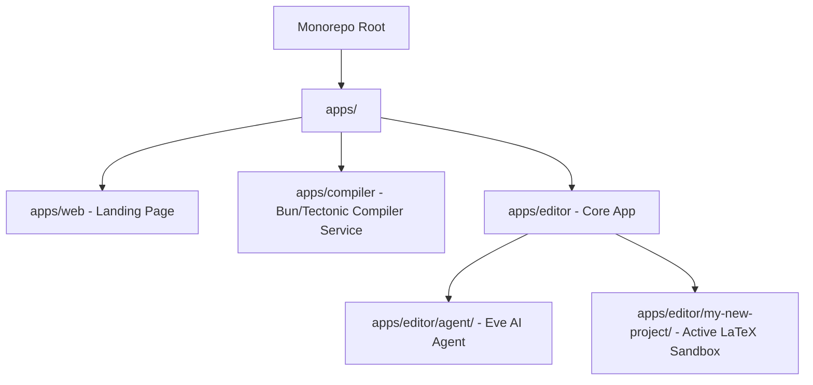

# Workspace Agent Rules: LaTeX Editor Monorepo

This file defines the project structure, scope boundaries, architectural constraints, and development guidelines for any AI assistant (like Antigravity) working on this codebase.

---

## OpenWiki

This repository has documentation located in the /openwiki directory.

Start here:
- [OpenWiki quickstart](openwiki/quickstart.md)

OpenWiki includes repository overview, architecture notes, workflows, domain concepts, operations, integrations, testing guidance, and source maps.

When working in this repository, read the OpenWiki quickstart first, then follow its links to the relevant architecture, workflow, domain, operation, and testing notes.

## 0. Implementation Policy: Find the Official Source First

Before writing custom logic for any non-trivial feature (parsers, protocol handling, format encoders/decoders, algorithms with a spec), **search for the official/upstream open-source implementation and port or vendor it instead of hand-rolling it.**

**Precedent**: SyncTeX support was originally a ~50-line hand-rolled `.synctex.gz` text parser in `apps/compiler/index.ts`. It was replaced with the official `synctex` CLI (github.com/jlaurens/synctex — the same tool TeX Live ships), built from source via `apps/compiler/scripts/build-synctex.sh` into `apps/compiler/bin/synctex`, and invoked as a subprocess (`synctex view` / `synctex edit`) instead of reimplementing the record format.

**Checklist for new implementation work:**
1. Identify the spec/format/protocol involved (e.g., SyncTeX, PDF, BibTeX, LaTeX macro expansion, S3 multipart uploads).
2. Search for the canonical open-source project — the reference implementation, or the tool the relevant ecosystem actually ships (e.g. what TeX Live bundles) — or a well-maintained library. Prefer an engine already in this repo's dependency tree (Tectonic, `@embedpdf/react-pdf-viewer`, etc.) over introducing a new one.
3. Prefer porting/vendoring/shelling out to that source over writing the parser or algorithm from scratch. A small build script that compiles or fetches the upstream tool (see `apps/compiler/scripts/build-synctex.sh`) is preferable to reimplementing its logic in TypeScript.
4. Only write custom code when no suitable official implementation exists, or vendoring it is impractical (license conflict, excessive size, no matching platform support) — state this explicitly rather than silently reinventing the wheel.
5. Record the upstream source (repo URL + version/commit) next to the vendoring code so it can be updated later.

This applies across the whole monorepo — LaTeX-adjacent parsing in the editor, citation/bibliography handling, PDF text extraction, etc. — not just the compiler.

## 1. Monorepo Project Structure

This is a Bun-managed monorepo with workspaces mapped under `apps/*`.

### 📂 Workspaces Breakdown

- **`apps/web/`**: Next.js marketing / landing page. It does not contain the editor workspace, the PDF viewer, or the AI agent integrations.
- **`apps/compiler/`**: A standalone Bun service running on port `3001` (by default) that spawns a `tectonic` subprocess to compile LaTeX files. It has two modes:
  - `local`: Compiles directly from a local absolute project path (for local dev).
  - `upload`: Compiles inside a temp directory from base64-encoded files sent in the POST request body, returning the compiled `.pdf` as a base64 string.
- **`apps/editor/`**: The core Next.js editor application.
  - **LaTeX Editor**: Integrated CodeMirror instance with custom LaTeX syntax highlight (`codemirror-lang-latex`).
  - **PDF Previewer**: Rendered using `@embedpdf/react-pdf-viewer`.
  - **Embedded AI Chat**: Powered by `@assistant-ui/react` and a custom Eve runtime.
  - **Eve Agent**: Housed in `apps/editor/agent/` with tools (`read-file.ts`, `write-file.ts`) to manage LaTeX files.

---

## 2. Scope Boundaries (CRITICAL)

There are two completely separate AI boundaries:

### 1️⃣ The Workspace Developer Agent (You / Antigravity)
- **Scope**: The monorepo code itself (`apps/editor/`, `apps/compiler/`, `apps/web/`).
- **Goal**: Edit the Next.js app logic, styling, layout, API routes, hooks, compiler logic, or the system prompt of the embedded agent.
- **Rules**: Never edit files inside `apps/editor/my-new-project/` (the LaTeX sandbox) unless explicitly requested for verification or template defaults.

### 2️⃣ The Embedded Editor Agent (Eve / apps/editor/agent)
- **Scope**: The **Active User LaTeX Project** only.
- **Goal**: Read, write, and manage `.tex` and `.bib` files.
- **Path Resolution**: The path resolution must always be scoped using `getProjectPath()` from `apps/editor/lib/project.ts` to prevent system directory traversal.
- **Rules**: Never suggest or explain Next.js app structure, React code, or monorepo configurations to the user. Its identity is strictly a **LaTeX Writing Assistant**.

---

## 3. UI & Chat Integration Rules (`@assistant-ui/react`)

The chat window in `apps/editor/components/chat/eve-thread.tsx` utilizes `@assistant-ui/react` connected to Eve.

### 🚫 Branching is NOT supported
- The runtime uses `useExternalStoreRuntime` which does not support message branching or branch histories.
- **Never re-add or render the `<BranchPicker />` component** in `apps/editor/components/assistant-ui/thread.tsx`. Doing so will cause runtime crashes ("Runtime does not support switching branches").

### 🛠️ HITL and Tool Call Rendering
- Custom tool renderers are defined in `apps/editor/components/assistant-ui/eve-tool-calls.tsx`.
- Human-in-the-loop (HITL) tools (specifically `ask_question`) must map to the custom `<HitlCard />`.
- The adapter `apps/editor/hooks/use-eve-runtime.ts` maps `part.toolName === "ask_question"` and the presence of `inputRequest` to the `__hitl__` type to ensure a correct card renders immediately.

---

## 4. Next.js & Turbopack Constraints

<!-- BEGIN:nextjs-agent-rules -->
# This is NOT the Next.js you know

This version has breaking changes — APIs, conventions, and file structure may all differ from your training data. Read the relevant guide in `node_modules/next/dist/docs/` before writing any code. Heed deprecation notices.
<!-- END:nextjs-agent-rules -->

- Always validate type safety using `bun x tsc --noEmit` inside `apps/editor/` when editing Next.js page or component files.
- **Next.js 16 File Convention**: `middleware.ts` is deprecated/renamed to `proxy.ts`. Ensure any middleware logic (e.g., Clerk Middleware) is defined in `proxy.ts` (or `proxy.js`) instead of `middleware.ts`.
- **Clerk Middleware in Next.js 16**: When using `clerkMiddleware()` inside `proxy.ts`, always ensure the configuration matcher array includes `'/__clerk/(.*)'` so that frontend sync requests are correctly intercepted and authenticated by the middleware. Otherwise, Clerk will fall into a login loop in development.

<!-- OPENWIKI:START -->

## OpenWiki

This repository has a generated `openwiki/` evidence index. It is optional just-in-time context, not required startup reading.

- Treat source code and tests as authoritative. A brief's unknowns and review items are verification gaps, not automatic requirements.
- Prefer the narrowest quiet validation that proves the changed behavior. Preserve complete failure output.

The scheduled OpenWiki GitHub Actions workflow refreshes the repository wiki. Do not hand-edit generated OpenWiki pages unless explicitly asked; prefer updating source code/docs and letting OpenWiki regenerate.

<!-- OPENWIKI:END -->
