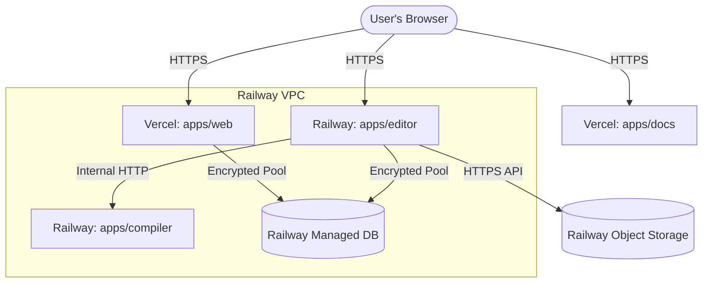

# Monorepo Production Deployment Guide

This guide details how to build and host the **SomeScript-adv** LaTeX system in production. It maps all local services inside `docker-compose.yml` to cloud infrastructure.

---

## 🏗️ Production Architecture Map

| Local Container (`docker-compose.yml`) | Production Cloud Target | Hosting Provider |
| :--- | :--- | :--- |
| `latex_editor_postgres` | **Serverless PostgreSQL** | Railway (Managed Add-on) |
| `latex_editor_rustfs` | **Object Storage** (S3 compatible) | Railway Buckets (Tigris) |
| `latex_editor_createbuckets` | *None* (Auto-provisioned by Railway) | Railway |
| `latex_editor_compiler` | **Web Service** (Bun + Tectonic) | Railway (Custom Dockerfile) |
| *Runs locally with Bun* (`apps/editor`) | **Next.js Web Service** | Railway (Custom Build) |
| *Runs locally with Bun* (`apps/web`) | **Next.js Serverless App** | Vercel |
| *Runs locally with Nuxt* (`apps/docs`) | **Static Nuxt/Docus Site** | Vercel |

---

## 📡 Private vs. Public Network Topography



---

## 📦 Part 1: Railway Infrastructure Setup

### 1. Database Provisioning (PostgreSQL)
1. Go to the [Railway Dashboard](https://railway.app) and create or open your project.
2. Click **New** → **Database** → **Add PostgreSQL**.
3. Railway automatically sets up the database. Note the connection string variable reference: `${{Postgres.DATABASE_URL}}`.

### 2. S3 Storage Provisioning
1. Click **New** → **Database** → **Add Object Storage**.
2. Railway creates an S3-compatible Tigris bucket.
3. Link the Object Storage service to your **Editor** service in the Railway canvas.

### 3. Deploy the Compiler Service (`apps/compiler`)
1. Click **New** → **GitHub Repo** → Choose `SomeScript-adv`.
2. Under **Settings**:
   - **Root Directory**: `apps/compiler`
   - **Custom Build Command**: (Leave empty, Railway automatically detects the local `Dockerfile`)
   - **Internal Service Port**: `3001`
   - **Healthcheck Path**: `/health` (Method: `GET`)
3. Note the generated internal private network domain. It will look like: `http://compiler.railway.internal:3001` (or whatever custom name you give the service).

### 4. Deploy the Editor App (`apps/editor`)
1. Click **New** → **GitHub Repo** → Choose `SomeScript-adv`.
2. Under **Settings**:
   - **Root Directory**: `/` (Monorepo root)
   - **Build Command**: `cd apps/editor && bun install && bun run build`
   - **Start Command**: `cd apps/editor && bun run start`
   - **Service Port**: `3002`
3. Link the **Postgres** and **Object Storage** services to this service to import the variables.
4. Define the variables below:

#### Editor Environment Variables (`apps/editor`)
| Variable | Value | Description |
| :--- | :--- | :--- |
| `STORAGE_PROVIDER` | `s3` | Uses S3 backend |
| `AWS_ENDPOINT` | `${{Object Storage.AWS_ENDPOINT_URL_S3}}` | Auto-injected |
| `AWS_ACCESS_KEY_ID` | `${{Object Storage.AWS_ACCESS_KEY_ID}}` | Auto-injected |
| `AWS_SECRET_ACCESS_KEY` | `${{Object Storage.AWS_SECRET_ACCESS_KEY}}` | Auto-injected |
| `AWS_BUCKET_NAME` | `${{Object Storage.BUCKET_NAME}}` | Auto-injected |
| `AWS_REGION` | `auto` | Required for Tigris |
| `DATABASE_URL` | `${{Postgres.DATABASE_URL}}` | Imports DB access credentials |
| `COMPILER_URL` | `http://compiler.railway.internal:3001` | Point to your compiler service |
| `COMPILER_MODE` | `upload` | Production upload compilation |
| `NEXT_PUBLIC_EDITOR_URL` | `https://editor.yourdomain.com` | Public domain of the editor |
| `NEXT_PUBLIC_CLERK_PUBLISHABLE_KEY` | `pk_live_...` | Production Clerk key |
| `CLERK_SECRET_KEY` | `sk_live_...` | Production Clerk secret |
| `OPENAI_API_KEY` | `sk-proj-...` | API Key for Eve AI runtime |

---

## ⚡ Part 2: Vercel Deployments

Vercel is optimal for the **Web Dashboard** and **Docs** because it serves next/nuxt apps via globally distributed serverless functions.

### 1. Deploy the Web Dashboard (`apps/web`)
1. Go to [Vercel](https://vercel.com) and click **Add New Project** → Choose the `SomeScript-adv` repository.
2. Under **Project Settings**:
   - **Framework Preset**: `Next.js`
   - **Root Directory**: `apps/web`
3. Add the following **Environment Variables**:

| Variable | Value | Description |
| :--- | :--- | :--- |
| `DATABASE_URL` | `postgresql://...` | Connection String copy from Railway Postgres |
| `NEXT_PUBLIC_CLERK_PUBLISHABLE_KEY` | `pk_live_...` | Production Clerk key |
| `CLERK_SECRET_KEY` | `sk_live_...` | Production Clerk secret |
| `CLERK_WEBHOOK_SECRET` | `whsec_...` | Obtained from Clerk webhook dashboard |
| `NEXT_PUBLIC_EDITOR_URL` | `https://editor.yourdomain.com` | The URL of the Railway Editor service |

4. Click **Deploy**.

### 2. Deploy the Documentation (`apps/docs`)
1. Go to Vercel and import the same repository.
2. Under **Project Settings**:
   - **Framework Preset**: `Nuxt.js` (Vercel automatically detects the Nuxt configuration)
   - **Root Directory**: `apps/docs`
3. Click **Deploy**.

---

## 🛠️ Part 3: Post-Deployment Steps

### 1. Database Schema Bootstrap
Because we utilize Drizzle ORM in push mode (`drizzle-kit push`), the database schema does not provision automatically.
You must run this once from your local environment pointing to your live production Database:

```bash
# From apps/web directory
DATABASE_URL=your_production_railway_database_url bun run db:push
```

### 2. Set Up Clerk Auth & Sync Webhook
1. Go to your **Clerk Dashboard** → Select Production Application.
2. Create a webhook endpoint: `https://your-web-dashboard.vercel.app/api/webhooks/clerk`
3. Select the events:
   - `user.created`
   - `user.updated`
   - `user.deleted`
4. Copy the **Signing Secret** and assign it to the `CLERK_WEBHOOK_SECRET` variable in Vercel for the web application.
