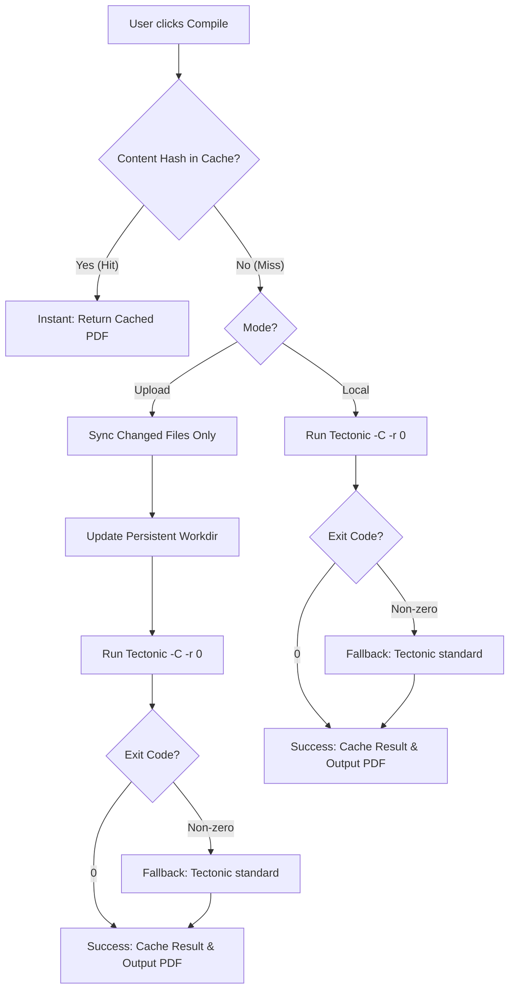

# Design Spec: LaTeX Compilation Speed Optimization (Hybrid Solution)

This document outlines the architectural changes, protocols, and interface improvements designed to maximize Tectonic LaTeX compilation speed in both local and remote (upload) environments.

## 1. Objectives
- Reduce local compilation time during active writing sessions (draft mode).
- Minimize network payload size and disk I/O when compiling in remote/upload mode (workspace caching).
- Avoid compilation overhead completely when documents are compiled with no modifications (SHA-256 output caching).
- Retain reliability by automatically falling back to robust, full-compilation modes if optimizations fail.

## 2. Speed Optimization Vectors



---

## 3. Detailed Architecture

### A. Output Caching (SHA-256 Memory Cache)
To avoid unnecessary CPU/IO cycles when the document state hasn't changed:
1. The compiler maintains an in-memory LRU cache of compiled PDFs indexed by the SHA-256 hash of the compilation payload.
2. For local mode, the payload is the path of the main `.tex` file plus its modification time/content hash.
3. For upload mode, the payload is the combined contents of all project files + the main file path.
4. If a cache hit occurs, the compiler returns the compiled PDF instantly.

### B. Tectonic Pass Control (Draft Mode)
Tectonic by default runs multiple passes (sometimes 2 or 3) to build auxiliary files like `.aux`, `.out`, `.toc` and resolve cross-references.
- **Optimization:** We will add a `draftMode` state to the editor settings.
  - If `draftMode` is enabled, the compilation request passes `draft: true`.
  - When `draft: true` is set, the compiler runs with `-r 0` (zero reruns after the first pass). This reduces compilation times by up to 40% on average.
  - When final checks or reference resolving is needed, the user can turn off `draftMode` (Final Mode) to run a standard multi-pass compilation.

### C. Smart Workspace Caching & Differential File Syncing (Remote / Upload Mode)
Currently, `upload` mode sends all files as base64-encoded strings, and the compiler creates a fresh temporary directory, writes all files, compiles, and deletes it. This is a massive bottleneck.
- **Optimization:**
  1. The compiler service stores project files in a persistent folder structured by `projectId`: `apps/compiler/workspaces/{projectId}/`.
  2. The compiler retains state across compilations.
  3. Instead of sending all files, the API route handler checks which files are modified or deleted since the last compilation.
  4. The compilation request payload format will be updated to:
     ```typescript
     interface CompileRequest {
       mode: "upload";
       projectId: string;
       fileRelativePath: string;
       draft?: boolean;
       syncType: "differential" | "full";
       files: { path: string; content: string }[]; // only changed/new files
       deletedFiles?: string[]; // paths to delete
     }
     ```
  5. The compiler updates only the modified files, deletes the items in `deletedFiles`, and compiles.
  6. If the workspace directory is deleted or missing on the compiler server (e.g., after cleanups or restarts), the compiler returns `requireFullSync: true`. The client then immediately triggers a full compilation (re-uploading all files).
  7. A periodic cleanup task (e.g., hourly cron) runs on the compiler service to delete project workspaces that haven't been compiled for more than 24 hours.

---

## 4. Implementation Steps

### Step 1: UI Toggle and State persistence
- Add a `draftMode: boolean` property to `settings` state in `apps/editor/app/page.tsx` (default: `true`).
- Add a toggle checkbox under "Project Settings" tab labeled "Draft Mode (Fast Compile)".
- Update settings saving/loading logic in localStorage.

### Step 2: Next.js API Route Differential Tracking
- Modify `apps/editor/app/api/compile/route.ts` to support project caching.
- Store a local map of file hashes/timestamps in the server cache (or memory) per `projectId`.
- Filter `getAllStorageFiles` output to only send files changed since the last compile.
- Support `requireFullSync` response from the compiler to trigger re-uploading all files.

### Step 3: Compiler Service Workspace Cache & Memory Cache
- Modify `apps/compiler/index.ts` to manage persistent workspaces under `workspaces/{projectId}/` instead of temp directories.
- Implement an in-memory LRU cache in `index.ts` for compiled PDF outputs indexed by project payload hashes.
- Implement file deletion logic for `deletedFiles`.
- Build the garbage collection utility for stale workspaces.
