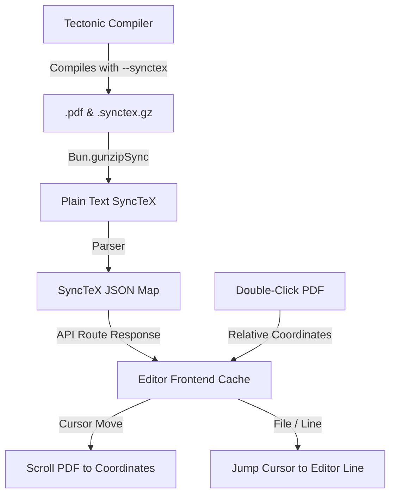

# Design Spec: Bidirectional SyncTeX Navigation

This document specifies the design for implementing bidirectional SyncTeX navigation (forward/backward sync) between the CodeMirror editor and the PDF previewer, using a zero-dependency pre-parsed approach.

## 1. Objectives & Requirements

- **Forward Sync**: When the cursor moves in the CodeMirror editor, highlight or scroll to the corresponding position in the PDF viewer.
- **Backward Sync**: When double-clicking on the PDF viewer, jump to the corresponding line in the CodeMirror editor.
- **Performance**: Zero-latency lookups on the frontend.
- **Simplicity**: No external dependencies; parse SyncTeX files directly using native Node/Bun APIs and clean regular expressions.

## 2. Architecture & Data Flow



### A. Compiler Service (`apps/compiler`)

We will compile using the `--synctex` flag:
```ts
// Compile flags
const flags = ["-C", "--synctex"];
```

After successful compilation, the compiler will look for the generated `.synctex.gz` file, decompress it using `Bun.gunzipSync`, parse it into a simplified JSON representation, and return it inside the JSON response of `/compile`.

### B. SyncTeX JSON Schema

The compiler will serialize the `.synctex.gz` file into this minimal schema:

```typescript
interface SyncTexData {
  files: Record<string, string>; // Maps file ID string to relative file path
  records: Array<{
    fileId: number;
    line: number;
    page: number;
    x: number;      // TeX points from left margin
    y: number;      // TeX points from top margin
    w: number;      // Width in TeX points
    h: number;      // Height in TeX points
  }>;
}
```

### C. The SyncTeX Parser implementation

A simple regex-based parser will extract `Input:` files and box coordinates (`h`, `v`, `[`):

```typescript
function parseSyncTex(rawText: string): SyncTexData {
  const files: Record<string, string> = {};
  const records: SyncTexData["records"] = [];
  let currentPage = 1;

  const lines = rawText.split(/\r?\n/);
  for (const line of lines) {
    if (line.startsWith("Input:")) {
      // Format: Input:<fileId>:<filepath>
      const parts = line.split(":");
      if (parts.length >= 3) {
        files[parts[1]] = parts.slice(2).join(":");
      }
    } else if (line.startsWith("{")) {
      // Page start: {<pageNumber>
      currentPage = parseInt(line.substring(1), 10);
    } else if (line.startsWith("h") || line.startsWith("v") || line.startsWith("[")) {
      // Box record: typeId,line,x,y,w,h...
      // Strip out type prefix character
      const content = line.substring(1);
      const parts = content.split(",");
      if (parts.length >= 6) {
        const fileId = parseInt(parts[0], 10);
        const lineNum = parseInt(parts[1], 10);
        const x = parseFloat(parts[2]);
        const y = parseFloat(parts[3]);
        const w = parseFloat(parts[4]);
        const h = parseFloat(parts[5]);
        
        if (!isNaN(fileId) && !isNaN(lineNum)) {
          records.push({ fileId, line: lineNum, page: currentPage, x, y, w, h });
        }
      }
    }
  }

  // ponytail: Keep payload minimal by filtering out redundant/identical line mappings
  const seen = new Set<string>();
  const uniqueRecords = records.filter(r => {
    const key = `${r.fileId}:${r.line}:${r.page}`;
    if (seen.has(key)) return false;
    seen.add(key);
    return true;
  });

  return { files, records: uniqueRecords };
}
```

### D. Next.js Integration & Frontend Communication

1. **Compilation Response**:
   Modify `apps/editor/app/api/compile/route.ts` to return the parsed `synctex` JSON object in addition to standard logs.
2. **Frontend Caching**:
   Add a `synctexData` state variable to `apps/editor/app/page.tsx` that caches the parsed result on a successful compile.

### E. Navigation Logic

1. **Forward Search (Editor -> PDF)**:
   - When cursor moves, locate current file relative path and line number in CodeMirror.
   - Match path to `files` map key to get `fileId`.
   - Search `records` for the closest line matching `fileId`.
   - Retrieve `page`, `x`, `y` coordinates.
   - Use `@embedpdf`'s `scrollHook.provides.scrollToPage({ pageNumber: page })` and scroll container elements to highlight or focus the matching position.
2. **Backward Search (PDF -> Editor)**:
   - Listen to double-click (`dblclick`) event on the PDF pages in `HeadlessPdfViewerInner`.
   - Calculate coordinates relative to the page width/height in TeX points (typically `PDF width * 72 / 96` depending on DPI).
   - Find the closest `record` matching `page` and coordinates `(x, y)`.
   - Jump to the corresponding file path and line number in CodeMirror.
